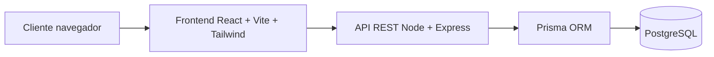
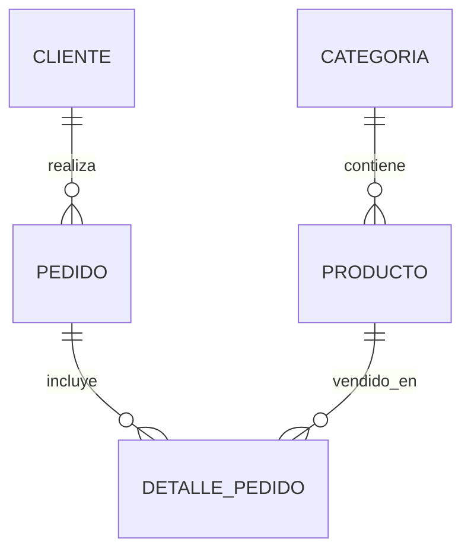

# 2. Arquitectura de la Solución y Diseño del Sistema

## 2.1 Arquitectura general
Arquitectura cliente-servidor:



Justificación tecnológica:
- React + Vite: interfaz SPA rápida, modular y mantenible.
- Node + Express: backend ligero para exponer servicios REST.
- PostgreSQL + Prisma: base de datos relacional y ORM seguro para consultas.

## 2.2 Diseño de base de datos



Diccionario resumido:
| Tabla | Campo | Tipo | Descripción |
|---|---|---|---|
| productos | id | int | Identificador |
| productos | nombre | varchar | Nombre del producto |
| productos | precio | decimal | Precio en soles |
| productos | stock | int | Cantidad disponible |
| productos | talla | varchar | Tallas disponibles |
| categorias | id | int | Identificador |
| categorias | nombre | varchar | Nombre de categoría |
| clientes | id | int | Identificador |
| clientes | celular | varchar | Contacto |
| pedidos | total | decimal | Total de compra |
| detalle_pedido | cantidad | int | Cantidad comprada |

## 2.3 Diseño de API
| Método | Endpoint | Descripción |
|---|---|---|
| GET | /api/productos | Lista productos |
| GET | /api/productos/:id | Obtiene producto |
| POST | /api/productos | Crea producto |
| PUT | /api/productos/:id | Actualiza producto |
| DELETE | /api/productos/:id | Elimina producto |
| POST | /api/pedidos | Registra pedido |

Request:
```json
{
  "nombre": "Zapatillas Running Alpha",
  "precio": 229,
  "stock": 12,
  "categoriaId": 1
}
```

Response:
```json
{
  "id": 1,
  "mensaje": "Producto creado correctamente"
}
```

Manejo de errores:
- 400: datos inválidos.
- 404: recurso no encontrado.
- 500: error interno del servidor.

## 2.4 Diseño UI/UX
- Interfaz responsive.
- Colores del logo: rojo, azul y blanco.
- Catálogo filtrable.
- Carrito visible.
- Botón de WhatsApp.
- Panel admin para CRUD.
